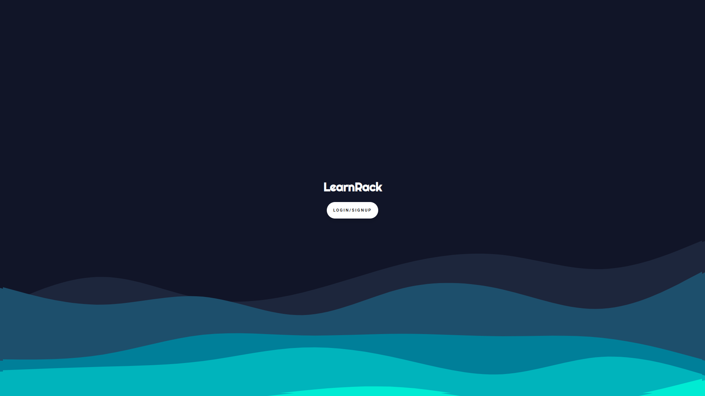
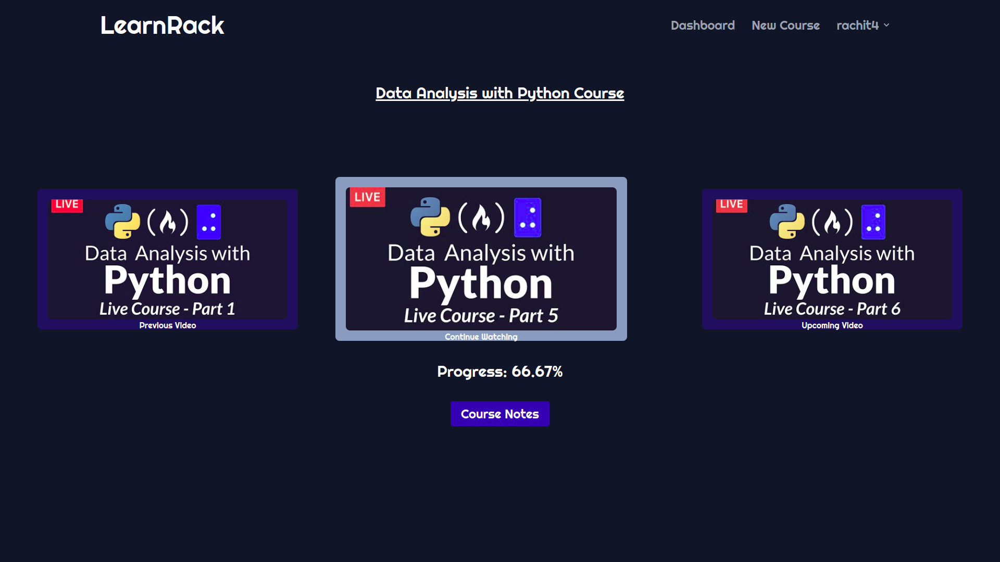
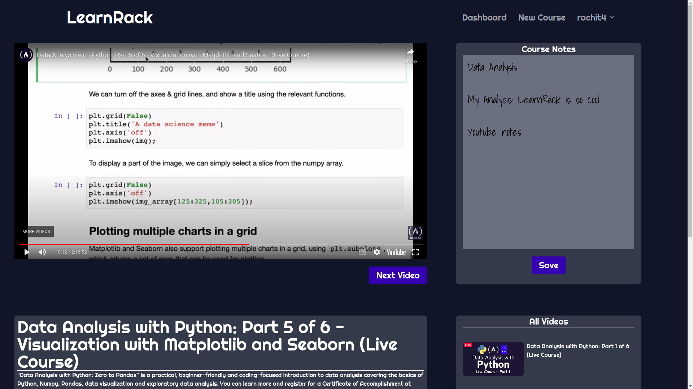

# [LearnRack](https://learnrack.study)
[learnrack.study](https://learnrack.study)

YouTube is a popular platform that many people use to access educational resources, but it was not designed specifically for learning. One of the drawbacks of using YouTube for learning is that it does not offer features to track progress in real-time or provide visual motivation through tools like bar graphs. Additionally, the suggested videos that appear on the side of the page can be a distraction and disrupt the learner's focus. LearnRack is a platform that was created to address these issues and enhance the learning experience. It is specifically designed to optimize the learning process and provide a more focused, effective and enjoyable way to study.

## About Team
Yash Singh - https://github.com/yashsinghhh  
Rachit Khurana - https://github.com/notnotrachit  
Pratibha Dureja- https://github.com/pratibhadureja  
Vasvi Garg - https://github.com/vasvigarg

## Tech Stack

**Client:** HTML/CSS, JavaScript, TailwindCSS 

**Server:** Python, Django, PostgreSQL

## Services Used

 - [auth0](https://auth0.com/)          
 - [Flowbite](https://flowbite.com/)
 - [Codepen](https://codepen.io/)
 - [Replit](https://replit.com/)
 - [Apyhub](https://apyhub.com/dashboard)
 

## API Used
* Apy Generate : HTML Content to PDF

## Run Locally

To deploy this project
1.  Install the dependencies
    `pip install -r requirements.txt`
2. Add env variables
3.  Run database migrations
    `python manage.py migrate`
4.  Create superuser
    `python manage.py createsuperuser`
5.  Collect Static
    `python manage.py collectstatic`
6.  Run server
    `python manage.py runserver`

## Environment Variables

To run this project, you will need to add the following environment variables to your .env file
* AUTH0_CLIENT_ID
* AUTH0_CLIENT_SECRET
* AUTH0_DOMAIN
* YOUTUBE_API_KEY
* APY_TOKEN
* db_username
* db_name
* db_password
* db_host
* db_port
## Screenshots

## Contributing

Contributions are always welcome!

